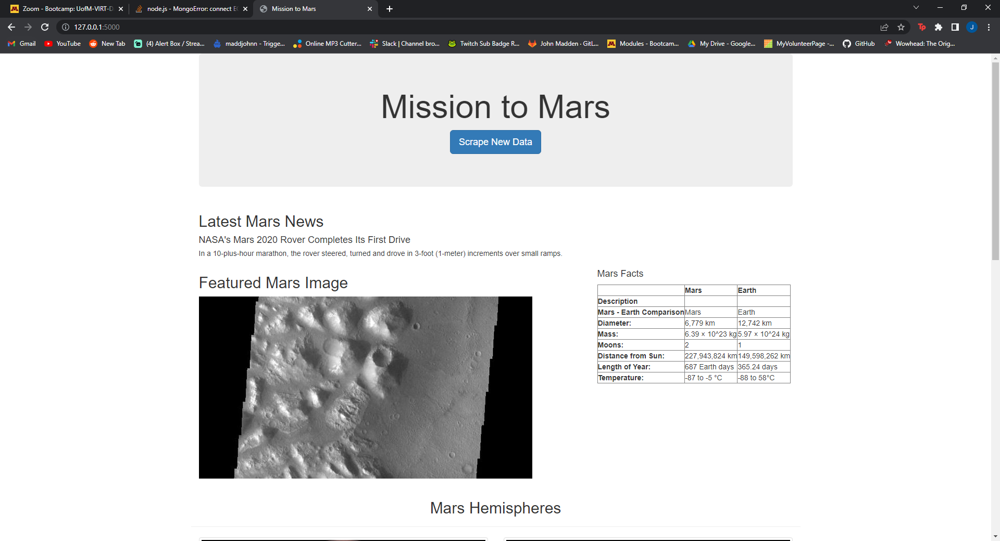

# Mission_To_Mars
## The purpose of this exercise was to use mongoDB in combination with Flask to webscrape a NASA website to create a repository of various Mars images to display surfaces of Mars as a custom built webpage 
## Proof that my scrape code ran correct is located below 
## 

